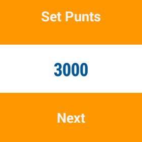

# EstrellaWallet

Para poder tener controlados tus gastos, y no tener sorpresas al cosnultar el saldo de tu cuenta. ¡Os presentamos EstrellaWallet! Con esta app vas a poder anotar facilmente todos tus gastos con comandos de voz en cualquier sitio.

Además podrás saber en todo momento cuanto te falta para poder conseguir los regalos de los puntos estrella de "La Caixa". Y todo esto desde tu Android wear.

Esta app ha sido realizada en la edición de FINAPPS PARTY del 2014 en Barcelona.

## Documentación
- [Video presentación](http://www.youtube.com)
- [Planes de futuro de EstrellaWallet](https://docs.google.com/presentation/d/1a_kOwYgRdA_nI4ZQO8BZANhKkCqGqaT9pUHFUQs6Zkg/edit)

## Capturas

### Pantalla principal

### Gastos

---

### Regalos del programa "Punts estrella"

### Configuración

---

## Autores
- [Isaac Obradors](https://github.com/isaacobradors)
- [Marc Comino](https://github.com/marccomino)
- [Néstor ](https://github.com/nmaletm)
